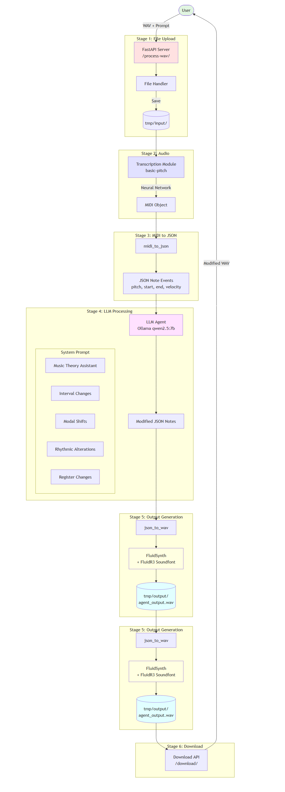

# 🎵 Composition Assistant

[](https://www.python.org/downloads/)
[](https://fastapi.tiangolo.com/)
[](https://docs.docker.com/compose/)
[](https://opensource.org/licenses/MIT)

**AI-powered music transformation tool** that enables musicians and developers to upload audio, describe desired changes in natural language, and receive transformed compositions in real-time.

<p align="center">
  
</p>

---

## 📋 Table of Contents

- [Overview](#overview)
- [Features](#features)
- [Architecture](#architecture)
- [Quick Start](#quick-start)
- [Configuration](#configuration)
- [API Reference](#api-reference)
- [Development](#development)
- [Monitoring](#monitoring)
- [Troubleshooting](#troubleshooting)
- [Contributing](#contributing)
- [License](#license)

---

## Overview

Composition Assistant is an agent-based system that combines audio transcription, large language models, and MIDI synthesis to transform music through natural language instructions. The workflow processes audio through a sophisticated pipeline:

```
WAV Audio → MIDI Transcription → JSON Notes → LLM Transformation → MIDI Synthesis → WAV Output
```

### Supported Transformations

| Transformation | Description | Example Prompt |
|---------------|-------------|----------------|
| **Interval Changes** | Transpose notes up or down by semitones | "Transpose up by 5 semitones" |
| **Modal Shifts** | Change notes to fit a different musical scale | "Convert to Dorian mode" |
| **Rhythmic Alterations** | Adjust note timing and tempo | "Double the tempo" |
| **Register Changes** | Move notes across octaves | "Shift melody up one octave" |

---

## Features

### Core Capabilities
- 🎤 **Audio Transcription** - Neural network-based audio-to-MIDI conversion using Basic Pitch
- 🤖 **AI Transformation** - Natural language music editing powered by Ollama LLMs
- 🎹 **High-Quality Synthesis** - FluidSynth rendering with General MIDI SoundFonts
- 🔄 **Iterative Editing** - Chain multiple transformations on output

### User Interface
- 📁 Drag-and-drop or file picker for WAV upload
- 💬 Free-form text prompt input
- 🏷️ Quick toggle buttons for common descriptors (Mood, Rhythm, Melody, Genre)
- 🎧 Real-time audio playback of transformed output
- 📱 Responsive design for desktop and mobile

### Platform Features
- 📊 **Prometheus Metrics** - Comprehensive monitoring and observability
- 📈 **Interactive Workflow Diagram** - Visual representation of the processing pipeline
- 🐳 **Fully Dockerized** - Containerized deployment with Docker Compose
- ⚡ **Health Checks** - Built-in service health monitoring

---

## Architecture

```
+-------------------------------------------------------------------------+
|                         COMPOSITION ASSISTANT                           |
+-------------------------------------------------------------------------+
|                                                                         |
|  +-----------+      +--------------------------------------------+      |
|  |   User    |      |            FastAPI Backend                 |      |
|  | Interface |<---->|  +------------+ +---------+ +------------+ |      |
|  |  (React)  |      |  |Transcriber |>|   LLM   |>|Synthesizer | |      |
|  +-----------+      |  |(BasicPitch)| | (Ollama)| |(FluidSynth)| |      |
|    Port 3000        |  +------------+ +---------+ +------------+ |      |
|                     +--------------------------------------------+      |
|                                   Port 8000                             |
|                                                                         |
|  +-------------------------------------------------------------------+  |
|  |                       External Services                           |  |
|  |  +---------------+  +---------------+  +---------------------+    |  |
|  |  | Ollama Server |  |  Prometheus   |  |  FluidR3 SoundFont  |    |  |
|  |  | (Port 11434)  |  |  (Optional)   |  |      (148 MB)       |    |  |
|  |  +---------------+  +---------------+  +---------------------+    |  |
|  +-------------------------------------------------------------------+  |
|                                                                         |
+-------------------------------------------------------------------------+
```

### Project Structure

```
CompositionAssistant/
├── src/                          # FastAPI backend application
│   ├── agents/
│   │   └── agent.py              # Main transformation agent
│   ├── clients/
│   │   └── llm.py                # Ollama LLM client
│   ├── core/
│   │   └── config.py             # Configuration management
│   ├── utils/
│   │   ├── audio_utils.py        # Audio processing utilities
│   │   ├── diagram_generator.py  # Workflow diagram generation
│   │   ├── metrics.py            # Prometheus metrics
│   │   ├── midi_json.py          # MIDI ↔ JSON conversion
│   │   └── transcribe.py         # Audio transcription
│   └── main.py                   # FastAPI application
├── ui/                           # React frontend application
│   ├── src/
│   │   └── App.jsx               # Main UI component
│   ├── Dockerfile
│   └── nginx.conf
├── scripts/                      # Setup and utility scripts
│   ├── setup-env.sh              # Environment configuration
│   ├── check-ollama.sh           # Ollama status checker
│   └── setup-personal.sh.template
├── FluidR3_GM/                   # SoundFont files
│   └── FluidR3_GM.sf2
├── docker-compose.yml            # Container orchestration
├── Dockerfile                    # Backend container image
├── Makefile                      # Build automation
├── requirements.txt              # Python dependencies
├── .env.example                  # Environment template
└── README.md
```

---

## Quick Start

### Prerequisites

- [Docker](https://docs.docker.com/get-docker/) and [Docker Compose](https://docs.docker.com/compose/install/)
- [Ollama](https://ollama.ai/) (for LLM inference)
- FluidR3_GM SoundFont (~148 MB) - [Download](https://sites.google.com/site/soundfonts4u/)

### Installation

1. **Clone the repository**
   ```bash
   git clone https://github.com/yourusername/CompositionAssistant.git
   cd CompositionAssistant
   ```

2. **Run initial setup**
   ```bash
   make setup
   ```

3. **Start Ollama and pull the model**
   ```bash
   ollama serve                    # Start Ollama server
   ollama pull qwen2.5:7b          # Pull the default model
   ```

4. **Verify Ollama is accessible**
   ```bash
   make check-ollama
   ```

5. **Build and start services**
   ```bash
   make start
   ```

6. **Access the application**
   - **UI**: http://localhost:3000
   - **API Docs**: http://localhost:8000/docs
   - **Metrics**: http://localhost:8000/metrics
   - **Workflow Diagram**: http://localhost:8000/workflow-diagram

### Makefile Commands

| Command | Description |
|---------|-------------|
| `make help` | Show all available commands |
| `make info` | Display project information and endpoints |
| `make setup` | Initial setup (create .env from template) |
| `make setup-full` | Interactive setup wizard |
| `make check-ollama` | Verify Ollama server status |
| `make start` | Build and start all services |
| `make stop` | Stop all services |
| `make restart` | Restart all services |
| `make logs` | View service logs |
| `make status` | Show detailed service status |
| `make health` | Check health of all services |
| `make clean` | Remove containers and volumes |
| `make clean-all` | Remove everything including images |

---

## Configuration

### Environment Variables

Configuration is managed through environment variables. Copy `.env.example` to `.env` and customize:

```bash
cp .env.example .env
```

| Variable | Default | Description |
|----------|---------|-------------|
| `OLLAMA_HOST` | `http://host.docker.internal:11434` | Ollama server URL |
| `OLLAMA_MODEL` | `qwen2.5:7b` | LLM model for transformations |
| `OLLAMA_API_KEY` | *(empty)* | Optional API key for Ollama Cloud |
| `SOUNDFONT_PATH` | `/app/FluidR3_GM/FluidR3_GM.sf2` | Path to SoundFont file |
| `API_PORT` | `8000` | Backend API port |
| `UI_PORT` | `3000` | Frontend UI port |
| `LOG_LEVEL` | `INFO` | Logging verbosity |

### Interactive Setup

For guided configuration:

```bash
make setup-env          # Interactive .env configuration
make setup-personal     # Load saved personal settings
```

---

## API Reference

### Endpoints

| Method | Endpoint | Description |
|--------|----------|-------------|
| `POST` | `/process-wav/` | Process audio file with transformation |
| `GET` | `/download/{filename}` | Download processed audio |
| `GET` | `/health` | Basic health check |
| `GET` | `/status` | Detailed status with Ollama connection |
| `GET` | `/metrics` | Prometheus metrics |
| `GET` | `/workflow-diagram` | Interactive workflow visualization |
| `GET` | `/config` | Current configuration |
| `GET` | `/ollama/status` | Ollama connection status |
| `GET` | `/docs` | Swagger API documentation |
| `GET` | `/redoc` | ReDoc API documentation |

### Process Audio

**Request:**
```bash
curl -X POST "http://localhost:8000/process-wav/" \
  -F "file=@input.wav" \
  -F "prompt=Transpose up by 3 semitones and add swing rhythm"
```

**Response:**
```json
{
  "filename": "agent_output.wav"
}
```

### Download Result

```bash
curl -O "http://localhost:8000/download/agent_output.wav"
```

---

## Development

### Local Development (without Docker)

1. **Set up Python environment**
   ```bash
   python -m venv venv
   source venv/bin/activate  # Windows: venv\Scripts\activate
   pip install -r requirements.txt
   ```

2. **Start the backend**
   ```bash
   make dev
   # Or directly:
   uvicorn src.main:app --reload --port 8000
   ```

3. **Start the frontend**
   ```bash
   cd ui
   npm install
   npm run dev
   ```

### Running Tests

```bash
make test           # Run test suite
make lint           # Run linter
```

---

## Monitoring

### Prometheus Metrics

The `/metrics` endpoint exposes comprehensive metrics in Prometheus format:

- **Workflow Metrics**: Execution counts, durations, active workflows
- **Audio Processing**: Files processed, sizes, durations
- **Transcription**: Operation counts and timings
- **LLM Requests**: Request counts, latencies, response sizes
- **MIDI Conversion**: Conversion operations by type
- **Errors**: Error counts by stage and type

### Grafana Integration

Import the provided Grafana dashboard (if available) or create custom dashboards using the exposed metrics.

### Health Monitoring

```bash
# Quick health check
make health

# Detailed status
make status

# View live metrics
curl http://localhost:8000/metrics
```

---

## Troubleshooting

### Common Issues

| Issue | Solution |
|-------|----------|
| **SoundFont not found** | Verify `FluidR3_GM.sf2` exists in `./FluidR3_GM/` directory |
| **Ollama connection failed** | Ensure Ollama is running: `ollama serve` |
| **Empty transcription** | Use clean, monophonic audio (piano/lead instruments work best) |
| **Invalid LLM response** | Try a different model or adjust the system prompt |
| **No audio playback** | Check browser console for 404 errors on download |

### Debugging

```bash
# View all logs
make logs

# View API logs only
make logs-api

# Shell into container
make shell-api

# Check Ollama status
make check-ollama
```

### Network Issues (Docker)

If the API cannot reach Ollama from within Docker:

1. Verify Ollama is listening on all interfaces:
   ```bash
   OLLAMA_HOST=0.0.0.0 ollama serve
   ```

2. Update `.env` with correct host:
   ```
   OLLAMA_HOST=http://host.docker.internal:11434  # Docker Desktop
   OLLAMA_HOST=http://172.17.0.1:11434            # Linux Docker
   ```

---

## Tech Stack

### Backend
- **Python 3.11** - Core runtime
- **FastAPI** - High-performance API framework
- **Uvicorn** - ASGI server
- **Basic Pitch** - Neural network audio transcription (TensorFlow)
- **pretty_midi** - MIDI manipulation
- **pyfluidsynth** - SoundFont synthesis
- **Ollama** - Local LLM inference
- **Prometheus Client** - Metrics collection

### Frontend
- **React** - UI framework
- **Vite** - Build tool
- **Tailwind CSS** - Styling
- **Nginx** - Static file serving

### Infrastructure
- **Docker Compose** - Container orchestration
- **Prometheus** - Metrics (optional)

---

## Contributing

Contributions are welcome! Please follow these steps:

1. Fork the repository
2. Create a feature branch (`git checkout -b feature/amazing-feature`)
3. Commit your changes (`git commit -m 'Add amazing feature'`)
4. Push to the branch (`git push origin feature/amazing-feature`)
5. Open a Pull Request

Please ensure your code follows the existing style and includes appropriate tests.

---

## License

This project is licensed to Ayaan Asish.

---

## Acknowledgments

- [Basic Pitch](https://github.com/spotify/basic-pitch) by Spotify for audio transcription
- [Ollama](https://ollama.ai/) for local LLM inference
- [FluidSynth](https://www.fluidsynth.org/) for MIDI synthesis
- [FluidR3 SoundFont](https://sites.google.com/site/soundfonts4u/) for General MIDI sounds

---

<p align="center">
  Made with ♡ by Ayaan<br>
  <sub>AI-assisted music creation since 2025</sub>
</p>
